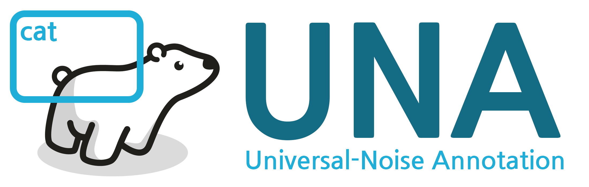
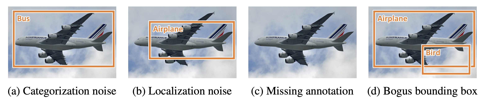

 

## Unveiling the Impact of Noise Annotation on Object Detection

 

This repository contains the code for generating **U**niversal-**N**oise **A**nnotation (UNA), which is a more practical setting that encompasses all types of noise that can occur in object detection. Additionally, experiment configuration files, log files, and links to download pre-trained weights are included.

You can use this code to simulate various types of noise and evaluate the performance of object detection models under different noise settings. It provides a comprehensive framework for studying the impact of noise on object detection algorithms.

# ⚡️ Quick Start

UNA dataset can be generated by una_inj.py.

~~~bash
python una_inj.py --ratio 0.1
~~~

una_inj.py takes following arguments

- `--path` : The file path to the COCO annotation JSON file (e.g., ./instances_train2017.json).
- `--target` : The file path where the UNA dataset will be stored.
- `--output` : Prefix for the output file.
- `--ratio` :  Intensity of the synthesized noise.
- `--class_type` : Select either 'coco' or 'voc'.

> **NOTE** : Currently, una_inj.py only supports the COCO format and VOC format.

### COCO Experiments

1. **Download COCO dataset**

First, you need to download the COCO dataset from the official website. You can obtain it from the [official COCO website](https://cocodataset.org/#home). Or you can use the [linked script](https://gist.github.com/mkocabas/a6177fc00315403d31572e17700d7fd9) for convenience.

2. **Generate UNA dataset**

You can use `una_inj.sh` to generate the UNA dataset. Please refer to the provided argument explanations above and make the necessary modifications.

~~~bash
git clone https://github.com/Ryoo72/UNA.git
cd UNA
bash una_inj.sh
~~~

3. **Experiment**

Enjoy your experiments using [MMDetection](https://github.com/open-mmlab/mmdetection), [Detectron](https://github.com/facebookresearch/detectron2), or your own framework. You need to modify the config file according to your situation.

### PASCAL VOC Experiments

1. **Download PASCAL VOC dataset**

PASCAL VOC dataset can be downloaded from the [official website](http://host.robots.ox.ac.uk/pascal/VOC/) or [mirror websites](https://pjreddie.com/projects/pascal-voc-dataset-mirror/). Alternatively, you can use the 'voc_download.sh' script in the 'tools' directory.

~~~bash
cd tools
bash voc_download.sh
~~~

2. **Format converting**

To use `una_inj.py`, the dataset needs to be converted to COCO format. You can use the [script](https://github.com/open-mmlab/mmdetection/blob/main/tools/dataset_converters/pascal_voc.py) provided by mmdetection for the conversion.

3. **Generate UNA dataset**

You can use `una_inj.sh` to generate the UNA dataset. Please refer to the provided argument explanations above and make the necessary modifications.

~~~bash
git clone https://github.com/Ryoo72/UNA.git
cd UNA
bash una_inj.sh voc
~~~

4. **Experiment**

Enjoy your experiments using [MMDetection](https://github.com/open-mmlab/mmdetection), [Detectron](https://github.com/facebookresearch/detectron2), or your own framework. If you want to convert the annotation file back to PASCAL VOC format, please refer to the following commands.

~~~bash
$ git clone https://github.com/KapilM26/coco2VOC.git
$ conda create --name voccoco python=3.8 -y
$ conda activate voccoco
$ cd coco2VOC
$ pip install -r requirements.txt
$ pip install --upgrade numpy
~~~

# 💾 Download UNA dataset
We provide the download link for the UNA dataset that we used for the experiments. The copyright of the annotations follow the [Creative Commons Attribution 4.0 License](https://creativecommons.org/licenses/by/4.0/legalcode) of the [MS COCO](https://cocodataset.org/#termsofuse) dataset.

|5%|10%|15%|20%|25%|30%|35%|40%|
|---|---|---|---|---|---|---|---|
|[link](https://lgresearch-my.sharepoint.com/:u:/g/personal/kwangrok_ryoo_lgresearch_ai/EYfL5gTFM-5GgGbmpIhEAvIBca9s4ks7Juau7oKwlvwy4w?e=oomgRz)|[link](https://lgresearch-my.sharepoint.com/:u:/g/personal/kwangrok_ryoo_lgresearch_ai/EQWRCREDSypAjOYLjmOMJMoBdJmgm9x1DQ3ltm5so9ybgA)|[link](https://lgresearch-my.sharepoint.com/:u:/g/personal/kwangrok_ryoo_lgresearch_ai/EdfuTZYSvjhApI4GFDH4l_4B_5oQ-dZ6m8S2m_rO5fw_dg?e=XJcRLA)|[link](https://lgresearch-my.sharepoint.com/:u:/g/personal/kwangrok_ryoo_lgresearch_ai/ESicCOxq51hPhOK6vFBnv9wBJx50_nZb2YnM4grBxRw7Ww)|[link](https://lgresearch-my.sharepoint.com/:u:/g/personal/kwangrok_ryoo_lgresearch_ai/EU5WBCY2Yq9Kvw64xOWgN0MBlrdtRGGu1nEGxscF-KDOcg?e=YtX9nR)|[link](https://lgresearch-my.sharepoint.com/:u:/g/personal/kwangrok_ryoo_lgresearch_ai/EZYZ-uqKOwpEpiX_CUStoD0Bns4BnwttJmSUkfgbFgNd1Q)|[link](https://lgresearch-my.sharepoint.com/:u:/g/personal/kwangrok_ryoo_lgresearch_ai/EbA13BosgHNGihjJD5irga4BnQiS5lDrYzOmgGi9Jar1VQ?e=5vIDFJ)|[link](https://lgresearch-my.sharepoint.com/:u:/g/personal/kwangrok_ryoo_lgresearch_ai/EenrvJTchYpDo_LwBfEhKu8BkwEAAVP6gfa3VE34A8zsvQ)|

# 📊 Overview of Benchmark
Experimental results for various types of detectors on the UNA setting.

  <b>Bbox mAP</b>

|Detector|Reference|Backbone|0%|10%|20%|30%|40%|
|:---|:-----:|:---:|:---:|:---:|:---:|:---:|:---:|
|**FasterRCNN**|[Ren et al.](https://arxiv.org/abs/1506.01497)|[ResNet-50](https://arxiv.org/abs/1512.03385)|37.4|33.1|26.6|16.2|1.0|
|**OHEM**|[Shrivastava et al.](https://arxiv.org/abs/1604.03540)|[ResNet-50](https://arxiv.org/abs/1512.03385)|37.7|32.9|25.3|13.1|0.3|
|**RetinaNet**|[Lin et al.](https://arxiv.org/abs/1708.02002)|[ResNet-50](https://arxiv.org/abs/1512.03385)|36.5|32.4|27.6|17.1|1.8|
|**FCOS**|[Tian et al.](https://arxiv.org/abs/1904.01355)|[ResNet-50](https://arxiv.org/abs/1512.03385)|36.5|33.2|29.7|23.4|9.0|
|**ATSS**|[Zhang et al.](https://arxiv.org/abs/1912.02424)|[ResNet-50](https://arxiv.org/abs/1512.03385)|39.4|36.1|32.4|26.2|11.8|
|**DINO**|[Zhang et al.](https://arxiv.org/abs/2203.03605)|[ResNet-50](https://arxiv.org/abs/1512.03385)|49.0|43.6|36.5|29.7|15.5|

- For more detailed setup, please refer to the configuration file.
- For more benchmarks, including the results on PASCAL VOC, please refer to our paper.

# 📄 License

Distributed under the MIT License. LICENSE contains more information.

# ✉️ Contact

If you have any questions or inquiries regarding the usage of this repository, please feel free to reach out to us at kwangrok.ryoo@lgresearch.ai. Your feedback and engagement are highly valued, and we look forward to hearing from you.
